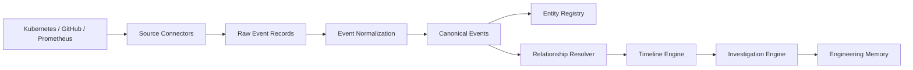

# Engineering Design Document

## Summary

Infragence will start as a modular monolith with clear domain boundaries. The platform ingests infrastructure events from Kubernetes, GitHub, and Prometheus, normalizes them into a common event model, links events to infrastructure entities, stores them in PostgreSQL, and exposes timeline and investigation workflows through a Next.js frontend and FastAPI backend.

## Design Goals

- Build a trustworthy system of record for infrastructure events.
- Preserve source evidence and ingestion metadata.
- Model infrastructure relationships explicitly.
- Support time-based investigation as the core workflow.
- Keep the MVP simple enough to operate.
- Avoid distributed systems until the product proves the need.

## Non-Goals

- Building a general observability backend.
- Replacing logs, metrics, traces, or dashboards.
- Creating a microservice architecture for the MVP.
- Introducing Kafka, RabbitMQ, or a graph database in v1.
- Depending on LLMs for core product functionality.

## Architecture Choice

Infragence should be built as a modular monolith:

- One backend deployable.
- One frontend deployable.
- One PostgreSQL database.
- One Redis instance.
- Source-specific connectors inside the backend boundary.
- Domain modules with explicit interfaces.

This keeps deployment simple while still allowing future extraction into services when traffic, team size, or operational isolation requires it.

## Core Modules

### Source Connectors

Responsible for collecting raw facts from external systems:

- Kubernetes connector
- GitHub connector
- Prometheus connector

Connectors should never directly create product conclusions. They collect source data and hand it to normalization.

### Event Normalization

Transforms source-specific payloads into canonical events.

Responsibilities:

- Validate source payload shape.
- Assign canonical event type.
- Preserve raw source reference.
- Extract timestamps.
- Attach candidate entity references.
- Mark confidence and parser version.

### Entity Registry

Maintains known infrastructure entities:

- Kubernetes clusters
- Namespaces
- Workloads
- Pods
- Services
- Repositories
- Pull requests
- Commits
- Alerts

### Relationship Resolver

Creates and updates relationships between entities and events.

Examples:

- Deployment event affects workload.
- Pull request produced commit.
- Commit triggered deployment.
- Alert fired for workload.
- Kubernetes event occurred in namespace.

### Timeline Engine

Builds ordered event streams for investigation.

Responsibilities:

- Query events by time, entity, source, and severity.
- Merge related events.
- Show unknown or low-confidence relationships.
- Preserve source timestamps and ingestion timestamps.

### Investigation Engine

Supports incident-style workflows.

Responsibilities:

- Create investigation from alert, entity, or time range.
- Collect related timeline evidence.
- Store human notes and conclusions.
- Link prior similar investigations.

### Engineering Memory

Stores durable operational knowledge.

Examples:

- Human-confirmed incident findings.
- Known recurring failure patterns.
- Service ownership notes.
- Prior remediation context.

Engineering memory must distinguish verified facts, derived relationships, and human-authored conclusions.

## Data Flow

## Storage Design

PostgreSQL is the primary data store. It should hold:

- Raw event envelope
- Canonical event rows
- Entity rows
- Relationship rows
- Investigation records
- Memory records
- Audit records

Redis should be used only for:

- Short-lived cache
- Lightweight background job coordination
- Rate limit counters
- Connector cursor locks

Redis should not hold authoritative product data.

## Reliability Expectations

- Event ingestion should be idempotent.
- Duplicate source events should collapse into one canonical event.
- Failed normalization should be stored and visible.
- Source API failures should be retried with backoff.
- Timeline queries should degrade gracefully when one source is missing.

## Security Expectations

- Secrets must never be stored in source payload logs.
- External tokens must be encrypted at rest.
- Raw event payloads must be scrubbed before persistence when they may contain sensitive values.
- All investigation and memory mutations must be auditable.

## Open Questions

- Should the MVP use polling, webhooks, or both for GitHub and Kubernetes events?
- What is the minimum relationship confidence model users will trust?
- How much raw source payload should be retained by default?
- Should investigations be manually created first, or automatically opened from high-severity alerts?

