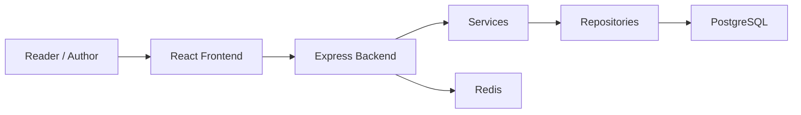
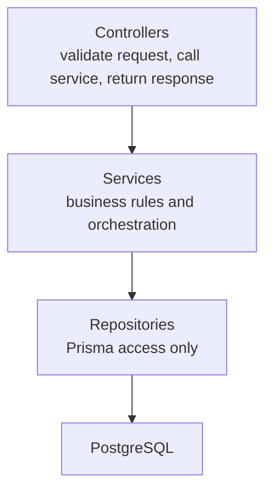
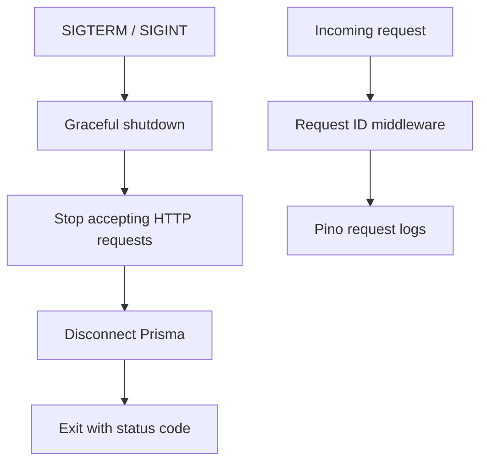
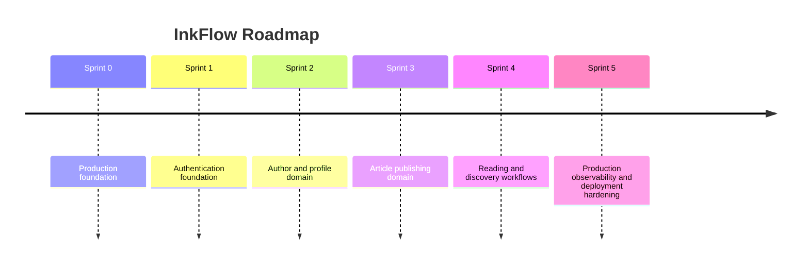

# InkFlow

InkFlow is a production-grade blogging platform foundation inspired by Medium.

## Vision

Build a maintainable SaaS blogging platform that can grow from a clean modular
monolith into a Kubernetes-ready production system.



## Architecture

The backend follows Clean Architecture boundaries.



Current foundation scope:

- No authentication
- No blog APIs
- No frontend pages
- No application database models

The complete architecture-freeze documentation lives under `docs/`:

- [Architecture](docs/architecture/ARCHITECTURE.md)
- [Domain Model](docs/design/DOMAIN_MODEL.md)
- [Database Design](docs/design/DATABASE_DESIGN.md)
- [API Specification](docs/api/API_SPECIFICATION.md)
- [Authorization](docs/design/AUTHORIZATION.md)
- [Security](docs/design/SECURITY.md)
- [Refresh Token Lifecycle](docs/design/REFRESH_TOKEN_LIFECYCLE.md)
- [Architecture Decision Records](docs/adr/README.md)

## Technology Stack

| Area | Technology |
| --- | --- |
| Frontend | React, TypeScript, Vite |
| Backend | Node.js, Express, TypeScript |
| Database | PostgreSQL |
| ORM | Prisma |
| Validation | Zod |
| Logging | Pino |
| Testing | Vitest, Supertest |
| API Docs | OpenAPI via Swagger UI |
| Local Runtime | Docker Compose |

## Folder Structure

```text
apps/
  backend/
    prisma/
    src/
      config/
      controllers/
      errors/
      health/
      lib/
        logger/
        metrics/
        swagger/
        tracing/
      middlewares/
      repositories/
      routes/
      services/
      types/
      validators/
    tests/
  frontend/
    src/
      components/
      features/
      lib/
      types/
docs/
scripts/
assets/
.github/
```

## Local Development

Create environment files:

```bash
cp .env.example .env
cp apps/backend/.env.example apps/backend/.env
cp apps/frontend/.env.example apps/frontend/.env
```

Install dependencies:

```bash
npm install
```

Run verification:

```bash
npm run lint
npm run build
npm test
```

Run local services:

```bash
docker compose up --build
```

The compose stack starts:

- backend
- frontend
- PostgreSQL
- Redis

## Operational Foundation



Included foundation:

- Environment validation during backend startup
- Request ID correlation for every HTTP request
- Pino application and HTTP logging
- HTTP compression
- Swagger UI initialized at `/docs`
- Kubernetes probe skeletons at `/health`, `/ready`, and `/live`
- Graceful shutdown for SIGTERM and SIGINT
- Non-root backend container runtime

## Project Roadmap


