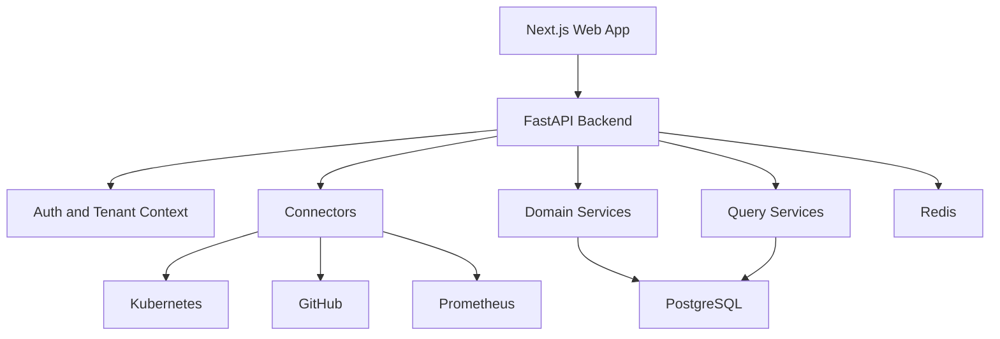

# System Architecture

## Architecture Overview

Infragence starts as a documentation-first modular monolith. The system is split into product domains inside one backend application, with clear module boundaries and stable contracts.

The architecture is intentionally boring at the deployment layer and ambitious at the data model layer.

## Logical Architecture

## Runtime Components

### Web Application

The frontend should be a Next.js application written in TypeScript. It should focus on operational workflows:

- Timeline exploration
- Entity detail pages
- Investigation views
- Evidence inspection
- Memory review

It should not start as a generic dashboard builder.

### Backend API

The backend should be a FastAPI application written in Python. It owns:

- Connector orchestration
- Event normalization
- Entity and relationship resolution
- Timeline queries
- Investigation workflow
- Engineering memory
- Auth and audit controls

### PostgreSQL

PostgreSQL is the authoritative store for normalized events, raw source references, entities, relationships, investigations, and memory.

PostgreSQL should be treated as a product dependency, not just storage. Strong relational constraints are part of the trust model.

### Redis

Redis is a supporting component for cache and coordination. It should not contain durable facts.

### External Systems

MVP integrations:

- Kubernetes API
- GitHub API and webhooks
- Prometheus API and Alertmanager-compatible payloads, where available

## Domain Boundaries

The backend should be organized around stable domains:

- identity
- sources
- ingestion
- events
- entities
- relationships
- timelines
- investigations
- memory
- audit

Module boundaries should be enforced through imports, tests, and code review. The goal is future service extraction without paying microservice complexity now.

## Data Flow Stages

1. Source connector receives or polls source data.
2. Raw envelope is stored with source metadata.
3. Normalizer produces a canonical event.
4. Entity resolver identifies affected entities.
5. Relationship resolver links events and entities.
6. Timeline engine serves ordered event context.
7. Investigation engine groups evidence and notes.
8. Engineering memory preserves durable knowledge.

## Deployment Topology

MVP deployment:

- Web app container
- API container
- PostgreSQL
- Redis
- Background worker process, if needed, using the same backend codebase

The background worker can be packaged from the same backend module. It should not become a separate service unless operational pressure proves the need.

## Scalability Model

The first scaling step is vertical and query-focused:

- Proper indexes
- Partitioned event tables when needed
- Cursor-based pagination
- Background processing
- Connector rate limiting

The second scaling step is modular extraction:

- Ingestion worker extraction
- Timeline query service extraction
- Relationship resolver extraction

Extraction should be driven by production evidence.

## Design Challenge

The biggest architectural risk is pretending that infrastructure intelligence is mostly a chat or UI problem. It is not. The durable value is in canonical events, relationship quality, and trustworthy timelines.

If those layers are weak, every interface above them will feel generic.

