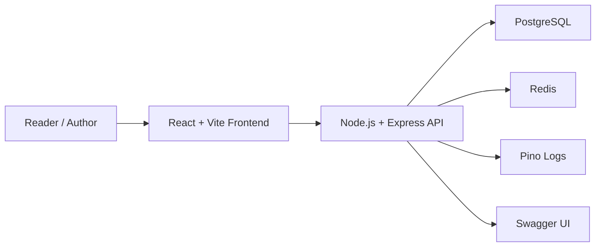
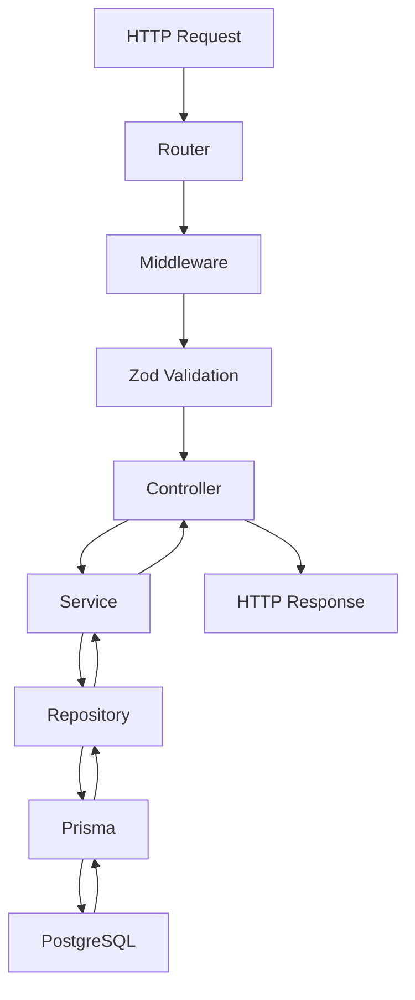
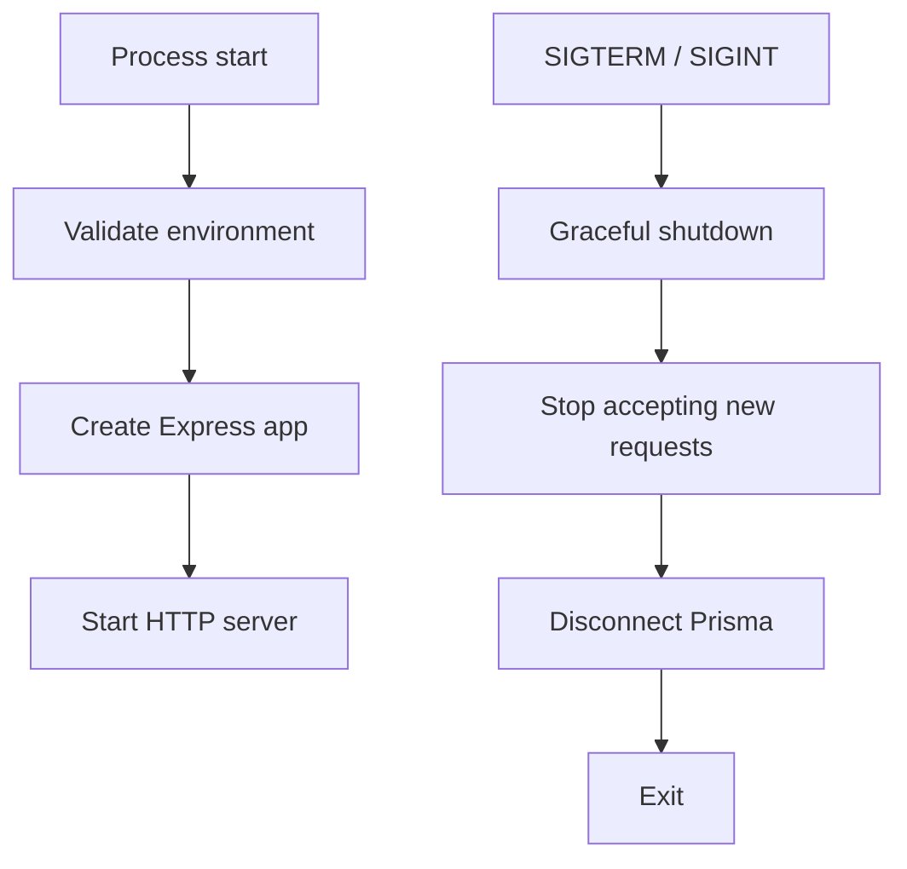

# InkFlow Architecture

## Purpose

InkFlow is a production-grade developer blogging platform built to demonstrate
professional backend engineering, DevOps readiness, Kubernetes readiness,
security, and production architecture.

The system optimizes for:

- Security
- Maintainability
- Simplicity
- Readability
- Testability
- Observability
- Free-tier friendliness

## System Context

Redis exists in the local foundation for future rate limiting and lightweight
coordination. It is not part of the current business domain.

## Backend Request Flow

## Layer Rules

Controllers:

- Validate incoming request data through approved validation flow.
- Call services.
- Return HTTP responses.
- Contain no business logic.
- Do not access Prisma.

Services:

- Own business logic.
- Own transaction orchestration.
- Coordinate repositories.
- Enforce domain rules.

Repositories:

- Are the only layer allowed to access Prisma.
- Contain persistence logic only.
- Do not contain business logic.

## Runtime Foundation

The backend must remain compatible with local development, Docker Compose,
AWS Free Tier constraints, and future self-managed Kubernetes deployment.

## Architecture Freeze Rule

After Spirit 1 approval, architecture changes require an ADR. Implementation
must follow this documentation unless a later approved ADR changes it.
