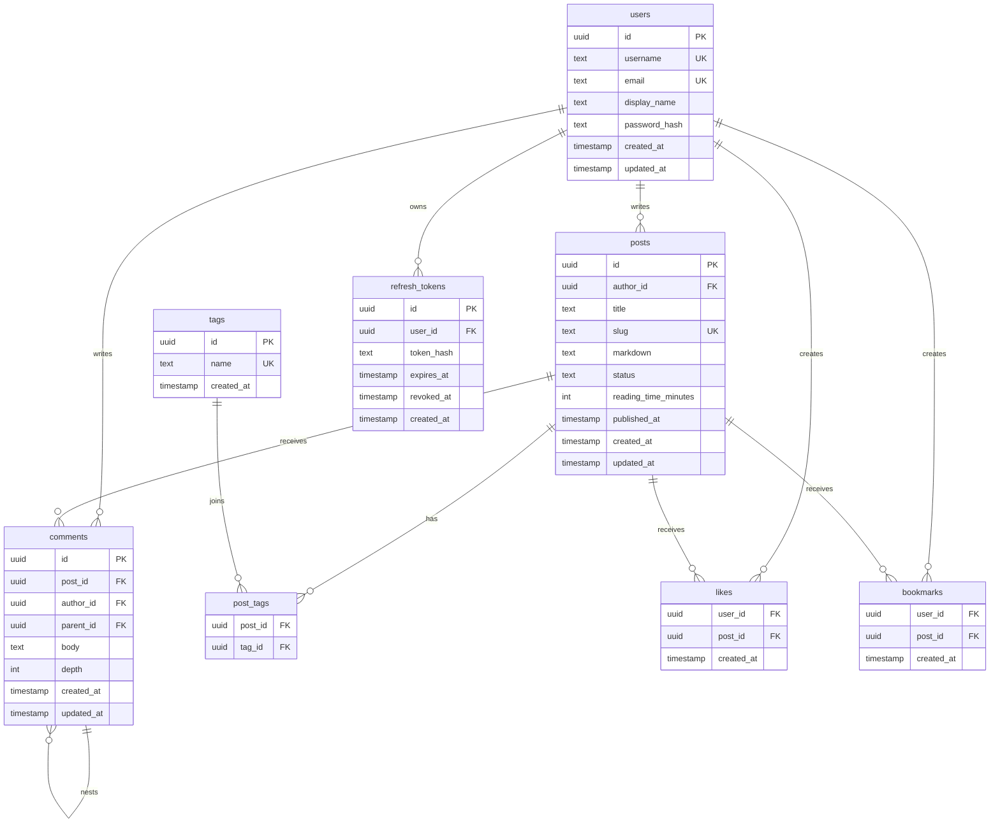

# Database Design

## Database

InkFlow uses PostgreSQL with Prisma.

Repositories are the only layer allowed to access Prisma. Services own business
logic and transactions.

## Entity Relationships

## Index Strategy

| Table | Index | Reason |
| --- | --- | --- |
| `users` | unique `username` | Enforces immutable unique usernames. |
| `users` | unique `email` | Enforces one account per email. |
| `posts` | unique `slug` | Supports immutable public post URLs. |
| `posts` | `author_id, created_at` | Supports user post lists. |
| `posts` | `status, published_at, id` | Supports homepage cursor pagination. |
| `comments` | `post_id, created_at` | Supports post comment lists. |
| `comments` | `parent_id` | Supports nested comment lookup. |
| `comments` | `author_id, created_at` | Supports user deletion and future user comment views. |
| `tags` | unique `name` | Prevents duplicate tag records. |
| `post_tags` | unique `post_id, tag_id` | Prevents duplicate tag assignment. |
| `post_tags` | `tag_id, post_id` | Supports tag-filtered post lookup. |
| `likes` | unique `user_id, post_id` | Enforces toggle uniqueness. |
| `likes` | `post_id` | Supports like counts. |
| `bookmarks` | unique `user_id, post_id` | Enforces toggle uniqueness. |
| `bookmarks` | `user_id, created_at` | Supports user bookmark lists. |
| `refresh_tokens` | `user_id` | Supports logout-all and user deletion. |
| `refresh_tokens` | unique `token_hash` | Supports token lookup and revocation. |
| `refresh_tokens` | `expires_at` | Supports cleanup of expired tokens. |

## Deletion Strategy

User deletion is hard delete.

The service layer must orchestrate deletion inside a Prisma transaction in this
order:

1. Refresh tokens
2. Bookmarks
3. Likes
4. Comments
5. Posts
6. User

Broad `ON DELETE CASCADE` rules must not be used as the primary deletion
mechanism. Foreign keys may still protect referential integrity.
