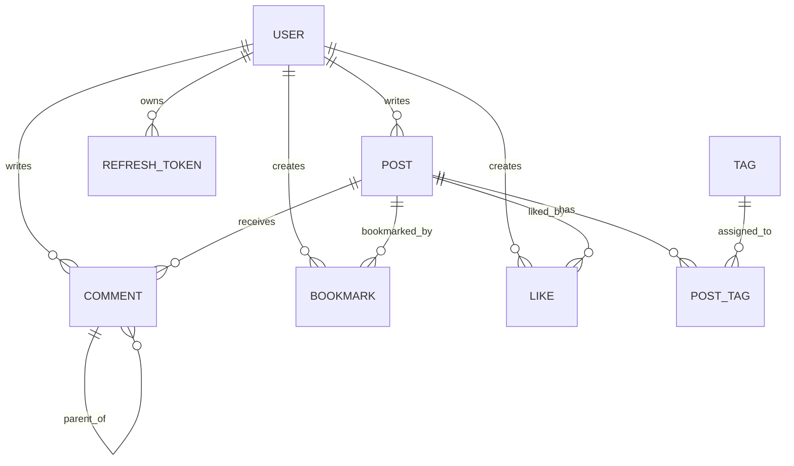

# Domain Model

## Core Entities

## User

Rules:

- Username is unique.
- Username is immutable.
- Email is unique.
- Display name is editable.
- Password is stored only as a bcrypt hash.

User deletion is hard delete and is orchestrated in the service layer.

## Post

Rules:

- Content is Markdown only.
- Drafts are supported.
- Draft saving is manual.
- Slug is immutable after creation.
- Reading time is calculated automatically.
- Posts are hard deleted.
- A post can have at most 5 tags.

## Comment

Rules:

- Comments are nested.
- Maximum nesting depth is 5.
- Comments are hard deleted during user deletion.

## Tag

Rules:

- Tags are user-created.
- Tags are reusable across posts.
- A post can have no more than 5 tags.

## Like

Rules:

- Likes are toggled.
- A user can like a post at most once.

## Bookmark

Rules:

- Bookmarks are toggled.
- A user can bookmark a post at most once.

## Refresh Token

Rules:

- Refresh tokens are stored hashed.
- Raw refresh tokens must never be stored or logged.
- Refresh tokens belong to a user.
