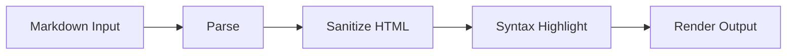

# Markdown Rendering

## Decision

InkFlow posts are Markdown only.

No image uploads are part of the approved architecture.

## Rendering Pipeline

## XSS Prevention

User-authored Markdown is untrusted input.

The rendering pipeline must:

- parse Markdown using an approved parser
- sanitize generated HTML before rendering
- remove unsafe tags and attributes
- block inline event handlers
- block unsafe URL protocols
- avoid trusting raw embedded HTML

## Storage

Store the canonical Markdown source. Rendered output may be generated at read
time or cached later if an ADR approves that architecture.
