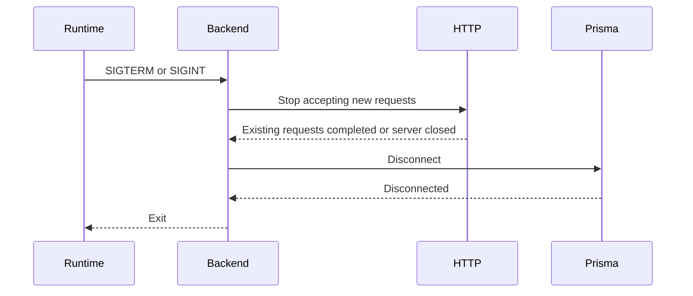

# Graceful Shutdown Runbook

## Purpose

The backend must shut down safely for local Docker usage and future Kubernetes
termination.

## Expected Flow

## Failure Mode

If graceful shutdown exceeds the configured timeout, the process exits with a
failure code.
